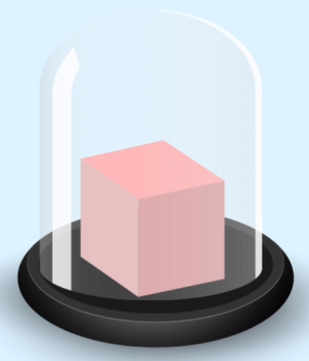

# JM researching -- CSS BFC
本文主要对reasearching中BFC的问题进行再次拓展以解决以下问题：
> 为什么会有BFC？
> BFC是什么？
> 如何触发BFC？
> BFC可以解决什么问题？


## 为什么会有BFC
在进行HTML布局时经常会遇到各种烦人的问题。比如：明明说好每个元素都是一个盒子，那在盒子外的元素应该不会受到盒内元素的影响但并不总是如此。在实际的布局中却经常遇到以下问题遇到这些情况的时候，或许可以试试BFC。
## BFC是什么
**BFC：** **`Block Formatting Context`** **块级格式化上下文**将提供一个环境，HTML元素会在这个环境中按照一定的规则进行布局。通俗的讲，BFC会让元素形成一个完全独立的空间，让空间中的子元素不会影响到外面的布局,如何才能形成这样的一个空间呢？我们为元素设置一些CSS属性就能触发这一空间。


## 如何触发BFC
最常用的触发条件有四种：
- `float`不为`none`
- `position`不为`relative`和`static`
- `overflow`为`auto`、`scroll`和`hidden`或者不为`visible`
- `display`的值为`table-cell`或`inline-block`


## BFC可以解决什么问题
通过三个实例来一起探讨：
**实例一：解决浮动元素令父元素高度坍塌的问题**
```html
<!DOCTYPE html>
<html lang="en">
<head>
    <title>Document</title>
</head>
<style>
body{
    padding: 0;
    margin: 0
}

.container{
    border: 1px solid;
    width:1300px;
    /* position:fixed; */
    /* display: table; */
    /* overflow: hidden; */
}

.left,.middle1,.middle2,.right {
    background: pink;
    width:300px;
    height:300px;
    float:left;
    font-size: 30px;
    color: #666;
    margin: 10px;
    text-align: center
}

/* .container:after{
    content: "";
    display: block;
    clear: left;
} */
</style>
<body>
    <div id="" class="container">
        <div id="" class="left">J</div>
        <div id="" class="middle1">M</div>
        <div id="" class="middle2">j</div>
        <div id="" class="right">m</div>
    </div>
</body>
</html>
```

**实例二：解决两栏布局自适应的问题**
```html
<!DOCTYPE html>
<html lang="en">

<head>
    <meta charset="UTF-8">
    <meta name="viewport" content="width=device-width, initial-scale=1.0">
    <meta http-equiv="X-UA-Compatible" content="ie=edge">
    <title>Document</title>
</head>
<style>
    * {
        margin: 0;
        padding: 0;
    }

    .left {
        background: #73DE80;
        /* 绿色 */
        opacity: 0.5;
        border: 3px solid #F31264;
        width: 200px;
        height: 200px;
        float: left;
    }

    .right {
        /* 粉色 */
        background: #EF5BE2;
        opacity: 0.5;
        border: 3px solid #F31264;
        width: 100%;
        min-height: 100px;
        /* overflow: hidden; */
    }

    .box {
        background: #fff;
        height: 100%;
        /* margin-left: 50px; */
        /* overflow: hidden; */
    }

    .little {
        background: #fff;
        width: 50px;
        height: 50px;
        margin: 10px;
        float: left;
    }
</style>

<body>
    <div class='box'>
        <div class='left'> </div>
        <div class='right'>
            <div class='little'></div>
            <div class='little'></div>
            <div class='little'></div>
        </div>
    </div>
</body>

</html>
```
**实例三：解决外边距垂直方向重合的问题**
```html
<!DOCTYPE html>
<html lang="en">

<head>
    <meta charset="UTF-8">
    <meta name="viewport" content="width=device-width, initial-scale=1.0">
    <meta http-equiv="X-UA-Compatible" content="ie=edge">
    <title>Document</title>
</head>
<style>
    body{
        padding: 0;
        margin: 0
    }
    .first-block {
        background: #F44336;
        width: 200px;
        height: 200px;
    }

    .second-block {
        background: #00BCD4;
        width: 200px;
        height: 200px;
        /* display:table; */
        /* overflow: hidden; */
    }
</style>

<body>
    <div class="first-block"></div>
    <div class="second-block">
        <h2>JM</h2>
    </div>
</body>

</html>
```

## 总结
通过上面三个例子，想必大家已经能大概了解BFC的用法。以下为再次对BFC的用法总结：
> - 解决浮动元素令父元素高度坍塌的问题
> - 解决两栏布局自适应的问题
> - 解决外边距垂直方向重合的问题
>解决的方式有：
>```css
> overflow:hidden;
> display:table-cell;
> display: block;
> position: fixed;
> position: absolute;
```

触发BFC的属性还有很多，但是选择要慎重，要考虑到实际的情况，避免影响到其他元素的布局。比如说：用`float`触发BFC的时候就要注意`float`可能对布局产生的影响，所以一定要想清楚用什么方式去触发它。