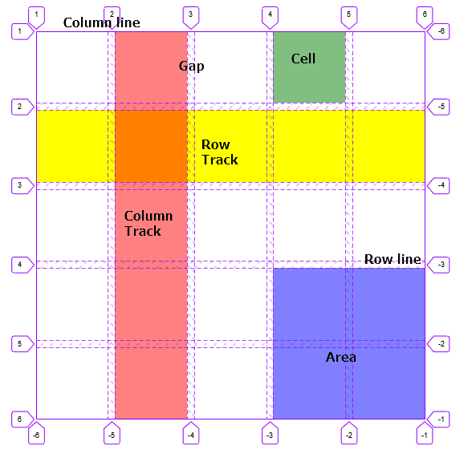
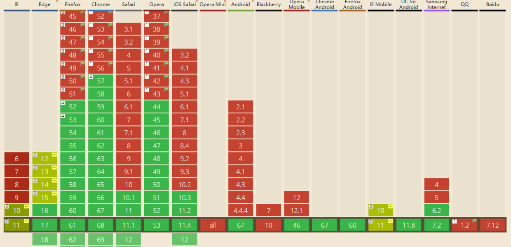

# 专题分享 -- CSS Grid

css的flex将容器变为一维布局, 意思是所有块级元素在父级容器设置为``display: flex``时, 都可以让其变为想要的轴线排列布局。而``display: grid``以及其他grid属性的出现, 则是将页面样式带入了二维布局中。Flex 布局是轴线布局，只能指定"项目"针对轴线的位置，可以看作是一维布局。Grid 布局则是将容器划分成"行"和"列"，产生单元格，然后指定"项目所在"的单元格，可以看作是二维布局。Grid 布局远比 Flex 布局强大。

## grid 基本概念

> **容器和项目**

采用网格布局的区域叫做'容器'(container), 在container上设置**display: grid**就能使用网格布局。而在容器内的元素我们称为'项目'(item), 在css grid里, 处理item的css属性有很多, 这些属性也足够使得grid网格布局更强大。

> **行和列**

容器里水平方向的项目称作行(row), 垂直方向的项目称作列(column)

> **单元格**

每一个item项目称作一个单元格, 单元格里可放不同元素, 元素在不同单元格里的不同样式组成了容器的不同布局

> **网格线**

划分网格的线，称为'网格线'（grid line）。水平网格线划分出行，垂直网格线划分出列。正常情况下，n行有n + 1根水平网格线，m列有m + 1根垂直网格线，比如三行就有四根水平网格线。

## grid 属性介绍

- row line: 行线
- column line: 列线
- track: 网格轨道，即行线和列线，或列线和列线之间所形成的区域，用来摆放子元素
- gap:  网格间距，行线和列线，或列线和列线之间所形成的不可利用的区域，用来分隔元素
- cell: 网格单元格，由行线和列线所分隔出来的区域，用来摆放子元素
- area: 网格区域，由单个或多个网格单元格组成，用来摆放子元素

### grid container 属性介绍

- **display: grid**
- **grid-template-rows**
- **grid-template-columns**
- **grid-template-area**: 网格布局允许指定"区域"（area），一个区域由单个或多个单元格组成。``grid-template-areas``属性用于定义区域, 需要配合grid-area使用。
- grid-auto-flow: 划分网格以后，容器的子元素会按照顺序，自动放置在每一个网格。默认的放置顺序是"先行后列"，即先填满第一行，再开始放入第二行.这个顺序由``grid-auto-flow``属性决定，**默认值是row**。也可以将它设成column

- display: inline-grid
- grid-row-gap
- grid-column-gap
- grid-gap

### grid item 属性介绍

- **grid-area**: 是``grid-column-start``、``grid-row-start``、 ``grid-column-end``、``grid-row-end`` 的缩写。同时也可以配合`grid-template-area`属性进行布局
- grid-column-start
- grid-column-end
- grid-row-start
- grid-row-end
- grid-column: 支持 '/'写法 和 span关键字
- grid-row

## 实例讲解

- grid布局对比

https://codepen.io/hzyhhh/pen/QWLajvr?editors=1100

- 实现同一个效果flex和grid对比 

http://192.168.83.3:8081//index.html#/callList

## 兼容性

## 参考

- [阮一峰 CSS Grid 网格布局教程](http://www.ruanyifeng.com/blog/2019/03/grid-layout-tutorial.html)

- [CSS：Grid布局](http://ghmagical.com/article/page/id/eAhyFiDCFGb6)

- [边学边玩CSS Grid](https://juejin.im/post/5b70c7c7e51d45666e2c6ade#heading-7)