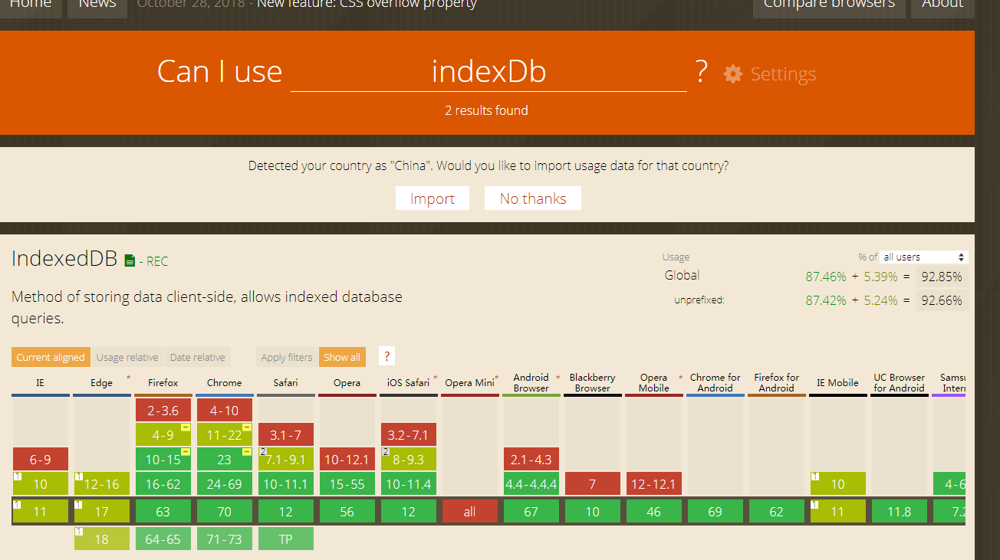

# 客户端储存: 对比localStorage和indexDB(2020.3.13)

## 背景

IndexedDB 是一种在用户浏览器中持久存储数据的方法。_它允许您不考虑网络可用性_，创建具有丰富查询能力的**可离线 Web 应用程序**。IndexedDB 对于**存储大量数据的应用程序**和不需要持久 Internet 连接的应用程序很有用。

---

## 是什么

> IndexedDB 是一种使用浏览器存储大量数据的方法.它创造的数据可以被查询，并且可以离线使用. IndexedDB 对于那些需要存储大量数据，或者是需要离线使用的程序是非常有效的解决方法. --- MDN

> 使用 IndexedDB，你可以存储或者获取数据，使用一个 key 索引的。 你可以在事务(transaction)中完成对数据的修改。和大多数 web 存储解决方案相同，indexedDB 也遵从同源协议(same-origin policy). 所以你只能访问同域中存储的数据，而不能访问其他域的。
>
> IndexedDB 是一种异步(asynchronous) API，异步 API 适用于大多数情况，包括 Web Workers。因为在 Web Workers 上的使用，它过去也有一个同步(synchronous)的版本，但是因为缺少 web 社区的支持，它已经被从规范中移除了。
>
> IndexedDB 过去有一个竞争规范—— WebSQL 数据库，但是 W3C 组织在 2010 年 11 月 18 日废弃了 webSql。尽管两者都是存储的解决方案，但是他们提供的不是同样的功能。IndexedDB 和 WebSQL 的不同点在于 WebSQL 是关系型数据库访问系统，IndexedDB 是索引表系统(key-value 型)。

## 为什么

Cookie 作为前端存储有这许多缺点,所以经过前端社区的不断努力,在 HTML5 中有了真正的前端存储方案--Web Storage.它分为两种,一种是永久存储的 localStorage,一种是会话期间存储的 sessionStorage.对比 Cookie,Web Storage 的优势很明显:

> - 存储空间更大,有 5M 大小
> - 在浏览器发送请求是不会带上 web Storage 里的数据
> - 更加友好的 API
> - 可以做永久存储(localStorage).

这一切看起来很完美,但是随着前端的不断发展,web Storage 也有了一些不太合适的地方:

> 1.  随着 web 应用程序的不断发展,5M 的存储大小对于一些大型的 web 应用程序来说有些不够
> 2.  web Storage 只能存储 string 类型的数据.对于 Object 类型的数据只能先用 JSON.stringify()转换一下在存储.

基于上述原因,前端社区又提出了浏览器数据库存储这个概念.而 Web SQL Database 和 indexedDB(索引数据库)是对这个概念的实现.其中 Web SQL Database 在目前来说基本已经被放弃.所以目前主流的浏览器数据库的实现就是 indexedDB(索引数据库).

## 怎么用

[api 介绍 ⬅]('https://developer.mozilla.org/zh-CN/docs/Web/API/IndexedDB_API')

### 打开

```js
var request = window.indexedDB.open("MyTestDatabase");
```

兼容性写法

```js
window.indexDB =
  window.indexedDB ||
  window.mozIndexedDB ||
  window.webkitIndexedDB ||
  window.msIndexedDB;

var request = window.indexDB.open("MyTestDatabase");
```

> 该 open 方法接受第二个参数，就是数据库的版本号。数据库的版本决定了数据库架构，即数据库的对象仓库（object store）和他的结构。如果数据库不存在，open 操作会创建该数据库，然后 onupgradeneeded 事件被触发，你需要在该事件的处理函数中创建数据库模式。如果数据库已经存在，但你指定了一个更高的数据库版本，会直接触发 onupgradeneeded 事件，允许你在处理函数中更新数据库模式。我们在后面的更新数据库的版本号和 IDBFactory.open 中会提到更多有关这方面的内容。

### 初始

> onupgradeneeded 是唯一可以更改数据库结构的地方。在其中，您可以创建和删除对象存储以及构建和删除索引。

初始的动作需要在 request.onupgradeneeded 内完成,该操作只会执行一次,类似与数据库的建表操作

该方法执行时会暴露 Event,该对象内 Event.target.result 属于 IDBDatabase 对象

IDBDatabase 对象可以由 onupgradeneeded 执行时暴露的 Event 获取 同时也可以 IDBOpenDBRequest.result 返回

Event.target.result 和 IDBOpenDBRequest.result 返回值都是 IDBDatabase 对象

```js
onupgradeneeded(evt) {
    // evt.target.result是一个IDBDatabase对象, 该对象可操作indexdb数据库, 常用的操作是用该对象创建字段
    this.db = evt.target.result;
    const { name, db } = this;
    if (!db.objectStoreNames.contains(name)) {
      const objectStore = db.createObjectStore("info", {
        keyPath: "id",
        autoIncrement: true
      });
      objectStore.createIndex("id", "id", { unique: true });
      objectStore.createIndex("name", "name");
      objectStore.createIndex("province", "province");
      objectStore.createIndex("address", "address");
      objectStore.createIndex("birthDate", "birthDate");

      objectStore.createIndex("remark", "remark");
    }

    console.log("---onupgradeneeded---");
  }
```

### CURD

> 在使用新数据库执行任何操作之前，需要启动事务。事务来自数据库对象，您必须指定要跨事务的对象存储。一旦进入事务，就可以访问保存数据的对象存储并发出请求。接下来，您需要确定是要对数据库进行更改还是只需要读取数据库。交易有三种可用模式：readonly，readwrite，和 versionchange。

CURD 操作需要 IDBObjectStore 对象

该对象由 IDBDatabase 对象下的 transaction(事务).objectStore 函数返回

由于数据库的操作都是基于事务（transaction）来进行，于是，无论是添加编辑还是删除数据库，我们都要先建立一个事务（transaction），然后才能继续下面的操作。语法就是名称：

```js
var transaction = db.transaction(dbName, "readwrite");
```

有该对象就能愉快的进行 CURD

```js
// 对数据库进行操作时 需要先获取到IDBDatabase对象
  add(item) {
    this.db = this.DBOpenRequest.result;

    const request = this.transaction.objectStore("info").add(item);
    return new Promise((resolve, reject) => {
      request.onsuccess = resolve;
      request.onerror = reject;
    });
  }

  delete(id) {
    this.db = this.DBOpenRequest.result;

    const request = this.transaction.objectStore("info").delete(id);
    return new Promise((resolve, reject) => {
      request.onsuccess = resolve;
      request.onerror = reject;
    });
  }

  readAll() {
    // 游标Cursor可以对数据对象进行批量操作
    const request = this.transaction.objectStore("info").openCursor();

    const list = [];

    return new Promise((resolve, reject) => {
      request.onsuccess = evt => {
        const cursor = evt.target.result;

        if (cursor) {
          list.push(cursor.value);
          cursor.continue();
        } else {
          resolve(list);
        }
      };

      request.onerror = reject;
    });
  }
```

## 兼容性



## 总结

### indexedDB 存储和 localStorage 存储对比

- indexedDB 存储 IE10+支持，localStorage 存储 IE8+支持，后者兼容性更好
- indexedDB 存储比较适合键值对较多的数据.在使用 localStorage 存储时，每次写入和写出都要字符串化和对象化，很麻烦，但如果使用 indexedDB 会轻松很多，因为无需数据转换。
- indexedDB 存储可以在 workers 中使用，localStorage 貌似不可以。这就使得在进行 PWA 开发的时候，数据存储的技术选型落在了 indexedDB 存储上面。

> 总结下就是，如果是浏览器主窗体线程开发，同时存储数据结构简单，例如，就存个 true/false，显然 localStorage 上上选；如果数据结构比较复杂，同时对浏览器兼容性没什么要求，可以考虑使用 indexedDB；如果是在 Service Workers 中开发应用，只能使用 indexedDB 数据存储。

## [**DEMO**](https://github.com/Hzyhhh/indexDB)

更多请参见:

[👍 IndexedDB](https://developer.mozilla.org/zh-CN/docs/Web/API/IndexedDB_API)

[Storing images and files in IndexedDB](https://hacks.mozilla.org/2012/02/storing-images-and-files-in-indexeddb/)

[👍 IndexedDB 中文教程](https://www.tangshuang.net/3735.html)

[👍 HTML5 indexedDB 前端本地存储数据库实例教程](https://www.zhangxinxu.com/wordpress/2017/07/html5-indexeddb-js-example/)
