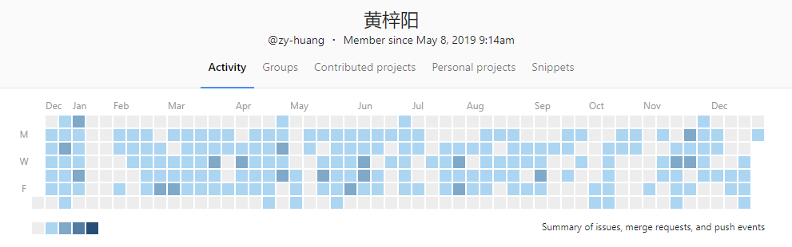

# 个人空间

这部分没有干货，主要是用来记录发表当下的心情。

_2020-3-17_

```

在上家公司，需求对于前端来说基本就是页面的交互，有时甚至觉得开需求评审会是极其浪费时间的事情。但是换了家公司之后我发现，很多需求并不是由产品提出的，而是直接由甲方按他们的需要整理出来。这个时候前端担任的角色就是梳理甲方的需要，总结成可以实现的需求，再加上自己对业务理解的广度将具体方案落地，进行开发。同时，将前端总结的开发需求中需要后端配合的部分，也整理成他们能理解的文档，再开发具体的业务内容。到这一步，前端需要扮演的角色除了本职前端开发之外，还有产品经理和业务经理。在这种情况下，前端对整个业务要非常了解，需求一定要非常清晰，才能在一次次其他团队成员找你过细节需求的时候把控住。演变到最后就会让你成为一个全栈，而这也是我来这家公司的目的！加油！

```

_2020-3-17_

```

RN要配置的环境好JB多

```

_2020-3-15_

```

入职优特电力第一天感触：

相比较小公司而言，优特电力的开发体系相对较为完善，有完整的开发、调试流程。但开发的细节可能没有抠得这么细，代码管控方面还有待加强。每个坑都有相应的业务量，负责的工作应该也仅是细分模块的业务功能。大概率没有工作量超载的情况。同时，这也是一个危险的信号，当工作量减少就意味着实际完成的时间缩短，对学习期望的阀值就会急速降低，从而产生工作完成就等待下班，无心学习的困境。需要警戒！

```

_2020-3-15_

```
12.4.0 32位版本的node-gyp yarn 不兼容，需要用到64位
```

_2020-3-4_

```
离职这周时间过得格外的慢
```

_2020-2-10_

```
过年回家提升自己，奥利给！
```

_2020-2-4_

```
一天一个垃圾需求, cnmd
```

_2020-2-3_

```
昨天的紧急项目, 一天做完, 总结一下:
1. 微信小程序webview的ua 里面有两个东西: micromessenger  miniprogram .所以,光是判断其中一个肯定是有bug的
2. 微信小程序webview(和WX webview行为一致)限制了唤醒本地app、打开下载地址的行为. 同时,小程序引导下载app等商业竞争的行为也不被允许!
3. 积累学习真的很重要, 尽量不要拿来就用. 多重构代码!
4. 遇到问题的思考方式从怎么样逐渐变成为什么,多从原理的方式尝试解释问题的产生!
5. 代码开工前一定要有全局思考的习惯, 项目重构不是一件好事(这里说的重构跟codeReview是不一样的,一个是优化现有代码的结构,一个是出发点就错了, 前者有利于让你保持良好代码风格的习惯, 后者让你多换几个架构多踩坑几个坑)
6. 在交互上遇到问题一定要找产品再三确认,说出你的想法, 不要憋在心里, 对自己和项目来说都是糟糕的
```

_2020-1-28_

[前端 20 年](https://zhuanlan.zhihu.com/p/68030183)

```
一篇介绍所以主流技术开端的历史文, 非常好看, 值得推荐!
```

_2020-1-28_

`decodeUriComponent`

```
qq客户端打开webview会将url encode, 需要decodeUriComponent解码
```

_2020-1-27_

```
我们判断一个需求能不能做,主要看以下几点:
1. 调试方不方便
2. 是否符合常规操作
3. 浏览器是否支持
4. 能否查到相关资料
```

_2020-1-27_

```
尽搞些jb非主流的操作,做兼容真tm麻烦!!!!!!!!!!!!!!!!!!!!!!!!!
```

_2020-1-26_

```
太jb搞事了, 下午4点提的需求.晚上8点就要升级
```

_2020-1-22_

```
dom-to-image和html2canvas在preact-router中会产生bug, 慎用!
```

_2020-1-19_

```
ios双卡用户切卡发短信真是难用!
```

_2020-1-15_

```
H5 唤起 native app 最重要看协议和打开方式
url scheme 后期出篇文章!
```

_2020-1-14_

```
byd 秦/宋 plus dm-i 还是香啊!
买不买是一回事,夸了再说!
```

_2020-1-14_

```
这个杯子的原理也很简单.
首先装热水/冷水.
静置的时候是个保温杯,杯壁是摸不到热度的.
摇晃的时候内部杯胆发生结构改变,可以传热到杯壁了.
听起来很不错.
但是!!!
冷水并不会摇着摇着变热水这是一点.
最主要如果我随身携带,随着身体的晃动就会散热.
也就是说,只要我带着,就算不用都会对外传热!!
等到想用的时候,不论怎么摇,都不会传热到杯壁了,因为已经变冷水了!!!!!
想想还是鸡肋
退货都不带思考的!
```

_2020-1-13_

```
这个杯子, 我被种草了! 真香!
```

_2020-12-30_

```
今天从同事嘴里得知了一个新产品 -- 暖手保温杯
？？？
又能暖手又能保温？
对外传热，热能还不降低？？
这是什么神仙产品！
想想应该是可行的。
毕竟放屁的一瞬间并不会让我体温降低这是真的！
```

_2020-12-30_

```
8.05到公交站就挺好！
```

_2020-12-29_

```
不想再凭运气赶公车了，想买辆车，唉！
```

_2020-12-28_



```
 gitlib 记录怎么才能转移到 github ?
 每次看到hub profile 缺了一大块贡献就难受:)。看来要好好维护 hub 了
 毕竟这才是名片嘛
```
