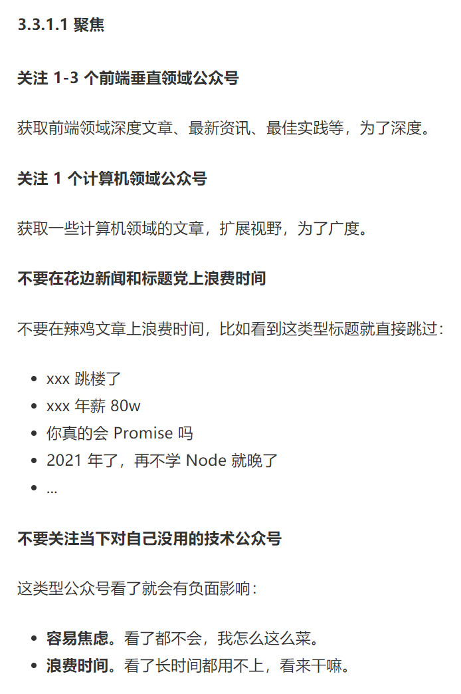

# 个人空间

这部分没有干货，主要是用来记录发表当下的心情。

_2022-12-25_

```
早上7点半在5公里内的十多个药店反复转圈
最后选了人最少的一家等待排队
现在人需要的也就那几种 布洛芬 抗原 连花清瘟
药店开门 每个人轮流录信息 取药 结账 平均5分钟/人 
药店供应的也很少
坐在门口放一个小篮子进行兜售
篮子空了代表没这几种药了
好巧不巧
如果真有人生病在这排队
排了一个小时队
却告诉你今天没药 下次请早
这意味着他今天都买不到药了
因为每家药店只有排前面的人能买到
选择排在这就放弃了其他药店的资源
这时候谁都会崩溃吧
---
国人喜欢囤货这无可厚非
但舆论放大必然是这波缺货的罪魁祸首
如果追求健康是每天早前选择药店蹲点
如果因为害怕感冒发烧没得看病
那只能保佑身体和精神能经得住这波人挤人的冲击不垮掉
---
害 珍惜当下的自由吧 带着镣铐跳舞的人儿
```


_2022-11-21_

```
睡眠质量堪忧啊! 
```

_2020-7-1_

```
共勉
```



_2020-6-23_

```
任何使用 JavaScript 编写的应用，都应该使用 TypeScript 来实现。
```

_2020-6-16_

```
报复社会吗？把代码rebase到一年前？？？
```

_2020-6-15_

```
昨晚做了一个梦，梦见一个人在一个新的集体里刚开始啥都不会，他开始通过揽不同类型的不熟悉的工作，在集团新人中以极快的速度成长为领导级别的人物。
梦是相反的吗？还是说这个梦里的案例也能带给我一些启示呢？
```

_2020-6-10_

```
人：某功能当时让你打包了三次都没给我。 我：遇到什么问题了吗？我们测过之后才提交的(把当时具体一起测试的人拉过来了)
人：……(对于该功能的一系列争论)。 我：……
人：某功能没验证过就发到现场去。我：验证过某功能确定能用才提交的
人：……(争论)。 我：……
人：群消息你没回复。 我：项目把控涉及到多个方面，我若能把控项目我就能回复
人：……(争论)。 我：……

总结一下这次的'讨论'。
    1. 某功能点完成了之后实际无环境测试，由于其他项目比较赶，把测试的工作暂时搁置一旁被人闲言闲语
    2. 群内消息本不是我做统筹，被指认为不回复

这次的事件其实就是一连串的小事堆积而引发，当事人没有把握到业务边界导致出了问题之后在互相甩锅。
总结我应该这样处理的：坦诚沟通，明确各项目业务边界，做好甩锅记录，分析当时的具体情况，最好给出一定回应。

对于项目流程的讨论还是吃了缺乏沟通的亏

```

_2020-5-31_

```
只有摘掉职位头衔带来的思维枷锁，你才能成为一个更全面的软件工程师

```

_2020-4-28_

```
rc-field-form 数据收集插件适用大多数一对一的情况，对于复杂情况较难适配
```

_2020-4-27_

```
解决开发过程中页面报错的方法：
1. mobx provider报错 -- 再保存多一次即可. 原因：修改store mobx提供的 provider组件重新加载了value 导致前后数据不一致
2. 修改页面保存后报错 -- 再保存多一次即可。 原因： 未知
3. 启动项目后报错 -- 清空缓存。 原因：merge过程对缓存数据版本有更新，新的更新对旧的项目不兼容，需要应用重新加载。
```

_2020-4-15_

```
跟人谈论技术的时候态度一定要端正，否则很容易发展成'开技术炮'(与地图炮的行为一致)。阐明你所持方的优点、便利性、合理性。基于哪个技术层面需要用到此类技术。击中技术痛点，不要漫篇跑火车。暂时想不出来不要出声就好，不要支支吾吾。想到了再把它拓展开说出去。
```

_2020-4-7_

```
看砍车价视频学到的技巧：
1. 不要对中意车型展露过多的喜爱，以免销售在你的心头好上重拳出击
2. 不要透露你心里的低价，以免让销售抓到你的把柄
3. 谈价态度要和蔼，不要居高临下
4. 要销售请示两遍领导，可能最终的优惠幅度会更大
5. 抱着今天就要买的心态，往往能有比较大优惠

```

_2020-4-7_

```
最喜欢看掘金大牛写的文章，每次都有醍醐灌顶的感觉。也每次都有要学更多东西的冲动，加油吧少年！

```

_2020-4-1_

```

出差回来，有很多感受 -- 其中最深的一点就是明确认知到自己还不够强，那种感觉好难受

```

_2020-3-23_

```

第一次出差竟然在入职的第二周，无语的一天

```

_2020-3-17_

```

在上家公司，需求对于前端来说基本就是页面的交互，有时甚至觉得开需求评审会是极其浪费时间的事情。但是换了家公司之后我发现，很多需求并不是由产品提出的，而是直接由甲方按他们的需要整理出来。这个时候前端担任的角色就是梳理甲方的需要，总结成可以实现的需求，再加上自己对业务理解的广度将具体方案落地，进行开发。同时，将前端总结的开发需求中需要后端配合的部分，也整理成他们能理解的文档，再开发具体的业务内容。到这一步，前端需要扮演的角色除了本职前端开发之外，还有产品经理和业务经理。在这种情况下，前端对整个业务要非常了解，需求一定要非常清晰，才能在一次次其他团队成员找你过细节需求的时候把控住。演变到最后就会让你成为一个全栈，而这也是我来这家公司的目的！加油！

```

_2020-3-17_

```

RN要配置的环境好JB多

```

_2020-3-15_

```

入职优特电力第一天感触：

相比较小公司而言，优特电力的开发体系相对较为完善，有完整的开发、调试流程。但开发的细节可能没有抠得这么细，代码管控方面还有待加强。每个坑都有相应的业务量，负责的工作应该也仅是细分模块的业务功能。大概率没有工作量超载的情况。同时，这也是一个危险的信号，当工作量减少就意味着实际完成的时间缩短，对学习期望的阀值就会急速降低，从而产生工作完成就等待下班，无心学习的困境。需要警戒！

```

_2020-3-15_

```
12.4.0 32位版本的node-gyp yarn 不兼容，需要用到64位
```

_2020-3-4_

```
离职这周时间过得格外的慢
```

_2020-2-10_

```
过年回家提升自己，奥利给！
```

_2020-2-4_

```
一天一个垃圾需求, cnmd
```

_2020-2-3_

```
昨天的紧急项目, 一天做完, 总结一下:
1. 微信小程序webview的ua 里面有两个东西: micromessenger  miniprogram .所以,光是判断其中一个肯定是有bug的
2. 微信小程序webview(和WX webview行为一致)限制了唤醒本地app、打开下载地址的行为. 同时,小程序引导下载app等商业竞争的行为也不被允许!
3. 积累学习真的很重要, 尽量不要拿来就用. 多重构代码!
4. 遇到问题的思考方式从怎么样逐渐变成为什么,多从原理的方式尝试解释问题的产生!
5. 代码开工前一定要有全局思考的习惯, 项目重构不是一件好事(这里说的重构跟codeReview是不一样的,一个是优化现有代码的结构,一个是出发点就错了, 前者有利于让你保持良好代码风格的习惯, 后者让你多换几个架构多踩坑几个坑)
6. 在交互上遇到问题一定要找产品再三确认,说出你的想法, 不要憋在心里, 对自己和项目来说都是糟糕的
```

_2020-1-28_

[前端 20 年](https://zhuanlan.zhihu.com/p/68030183)

```
一篇介绍所以主流技术开端的历史文, 非常好看, 值得推荐!
```

_2020-1-28_

`decodeUriComponent`

```
qq客户端打开webview会将url encode, 需要decodeUriComponent解码
```

_2020-1-27_

```
我们判断一个需求能不能做,主要看以下几点:
1. 调试方不方便
2. 是否符合常规操作
3. 浏览器是否支持
4. 能否查到相关资料
```

_2020-1-27_

```
尽搞些jb非主流的操作,做兼容真tm麻烦!!!!!!!!!!!!!!!!!!!!!!!!!
```

_2020-1-26_

```
太jb搞事了, 下午4点提的需求.晚上8点就要升级
```

_2020-1-22_

```
dom-to-image和html2canvas在preact-router中会产生bug, 慎用!
```

_2020-1-19_

```
ios双卡用户切卡发短信真是难用!
```

_2020-1-15_

```
H5 唤起 native app 最重要看协议和打开方式
url scheme 后期出篇文章!
```

_2020-1-14_

```
byd 秦/宋 plus dm-i 还是香啊!
买不买是一回事,夸了再说!
```

_2020-1-14_

```
这个杯子的原理也很简单.
首先装热水/冷水.
静置的时候是个保温杯,杯壁是摸不到热度的.
摇晃的时候内部杯胆发生结构改变,可以传热到杯壁了.
听起来很不错.
但是!!!
冷水并不会摇着摇着变热水这是一点.
最主要如果我随身携带,随着身体的晃动就会散热.
也就是说,只要我带着,就算不用都会对外传热!!
等到想用的时候,不论怎么摇,都不会传热到杯壁了,因为已经变冷水了!!!!!
想想还是鸡肋
退货都不带思考的!
```

_2020-1-13_

```
这个杯子, 我被种草了! 真香!
```

_2020-12-30_

```
今天从同事嘴里得知了一个新产品 -- 暖手保温杯
？？？
又能暖手又能保温？
对外传热，热能还不降低？？
这是什么神仙产品！
想想应该是可行的。
毕竟放屁的一瞬间并不会让我体温降低这是真的！
```

_2020-12-30_

```
8.05到公交站就挺好！
```

_2020-12-29_

```
不想再凭运气赶公车了，想买辆车，唉！
```

_2020-12-28_


```
 gitlib 记录怎么才能转移到 github ?
 每次看到hub profile 缺了一大块贡献就难受:)。看来要好好维护 hub 了
 毕竟这才是名片嘛
```
