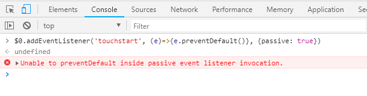

## 什么是 passive 事件处理器？有什么好处

问题起因：

> 当我们给 document 添加了 touch 事件的监听器的时候，如果同时在 handler 内部调用了`event.preventDefault()`，这时候浏览器（Chrome 56+）就会报一个`warning：Unable to preventDefault inside passive event listener due to target being treated as passive`



### passive

> 简而言之就是当我们在滚动页面的时候（通常是我们监听 touch 事件的时候），页面其实会有一个短暂的停顿（大概 200ms），浏览器不知道我们是否要 preventDefault，所以它需要一个延迟来检测。这就导致了我们的滑动显得比较卡顿。

### addEventListener 的第三个参数

```js
target.addEventListener(type, listener[, useCapture]);
target.addEventListener(type, listener[, options]);
```

useCapture 参数用来控制监听器是在捕获阶段执行还是在冒泡阶段执行，true 为捕获阶段，false 为冒泡阶段，变成选填后默认值为 false（冒泡阶段）。

### 用法

我们可以通过传递*addEventListener*第三个参数 {passive：true} 来明确告诉浏览器，事件处理程序不会调用 preventDefault 来阻止默认滑动行为,`解决了执行监听器之后再执行默认行为的操作导致的卡顿现象`。

### 结论

从 Chrome 56 开始，如果我们给 document 绑定 touch 事件的监听器，这个 passive 是会被默认设置为 true 以提高性能。但是我们大多数人并不知道这点，并且依旧调用了 preventDefault。这并不会导致什么页面崩溃级的错误，但是这可能导致我们忽略了一个页面性能优化的点，特别是在移动端这种更加重视性能优化的场景下。
