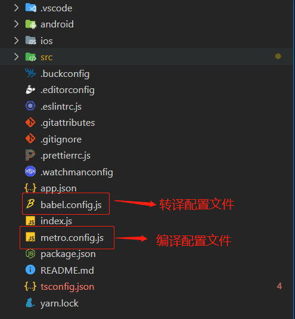
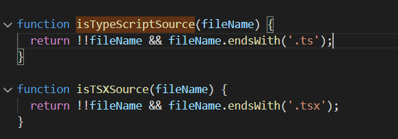

## React Native 能支持 Typescript 到什么地步?

## 疑问的产生

新团队在业务上使用 app + web 的模式, 具体的开发框架也就自然而然地选择了 `React Native` + `Vue`, 所以在选人方面就没有这么多技术限制; 基本上来人就能做业务.

开发语言选型了 js. 极大提高了业务的灵活性. 虽然是使用弱类型语言, 但 `RN` 在由模板创建的一刻起就支持 `typescript`, 这也是这篇文章诞生的前提:

在写`RN`的过程中发现一个很有意思的现象, 在原有 js 架构上引入 ts 甚至 tsx 后在原有的架构上都不会有报错或者是不兼容的提示.

我一度认为这个兼容是该项目创作者特地为之. 随着开发的深入和对架构的理解后我发现. **并不是**.

## 实践的过程

我使用 RN 模板创建了一个 RN-App, RN 并没有像 Web 的 React、Vue 一样用 webpack 这类构建工具, 反倒使用的是 facebook 自研的编译工具 [`Metro`](https://facebook.github.io/metro/docs/getting-started), 在转译方面使用比较广泛的 babel. 所以整个 RN 应用看起来还是比较简洁的.

在 babel 的配置文件中,也只有的一个预设配置 metro-react-native-babel-preset 因此我的测试路线就变成了这样:

- 解释问题缘由
- 已知 React 特性包括 jsx、ESNext 等可能会影响编译的问题
- 在排除 babel 插件支持 react 特性的情况下考虑以下几个问题：
- - 纯 js 编写 RN 是否编译异常 （大概率会）
- - 若不会，能否支持 flow 或者 typescript (大概率不能)
- - 能否得出总结：RN 在没有任何特性支持的情况下不能编译。现有官方推荐 babel 插件能支持 jsx/tsx、EXNext(✔ 真理)

## 真相

在翻阅 `metro-react-native-babel-preset` 源码的过程中, 代码前几行赫然把该篇文章的答案写了出来, 预设已经将所有 ts、tsx 文件用 `@babel/plugin-transform-typescript` 帮你转好了.

## RN runtime 运行时

初始化 React Native

- babel 转义 ESNext、ts、tsx 成 JavaScript

- 读取 JavaScript 源码

- JavaScript 加载进内存, JSX 代码已经被转化成原生的 JavaScript 代码

- 初始化模块信息

- 这一步在方法 initModulesWithDispatchGroup 中实现，主要任务是找到所有需要暴露给 JavaScript 的类

- 初始化 JavaScript 代码的执行器，即 RCTJSCExecutor 对象

- 生成模块列表并写入 JavaScript 端

- 执行 JavaScript 源码

## 参考

- [metro-react-native-babel-preset 源码](https://github1s.com/facebook/metro/blob/master/packages/metro-react-native-babel-preset/src/configs/main.js)

- [知乎 - RN 集成 TypeScript 方案和问题大全](https://zhuanlan.zhihu.com/p/66243553)

- [React-Native 运行机制](https://segmentfault.com/a/1190000005775584)
