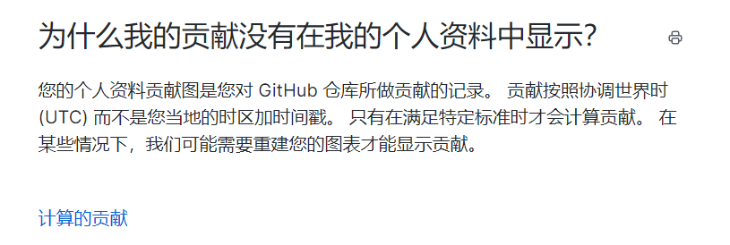
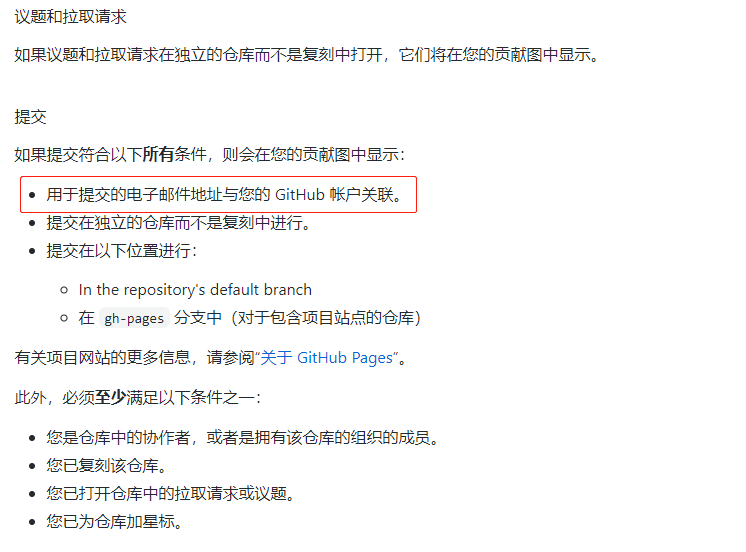

# Git 提交未计算贡献 --解决办法

如果哪天你发现自己在 GitHub 提交了记录, 但是首页的小绿格没有增加, 你可以参考下这篇文章！

开始以为是延迟，或者需要第二天才能看到自己提交的贡献点



后来发现并不是这样的。

GitHub 的 Commit 记录和**本地的配置用户名以及邮箱与 GitHub 不一致**会导致不增加贡献！



后来发现因为是在公司提交代码，所以在公司配置的默认是是公司的邮箱，而不是自己的邮箱 😅 干哦~

## 解决办法

1. 修改全局默认邮箱的用户名和邮箱

```
 git config --global user.name "Hzyhhh"
 git config --global user.email "799309084@qq.com"
```

2. 修改单个 Git 仓库的用户名和邮箱

```
cd .git
git config user.name "ordinaryA"
git config user.email "353458582@qq.com"
```

然后通过执行命令可以查看 config 文件检查是否修改成功：

```
cat config
```

## 找回之前的提交记录

完成以上步骤后，虽然提交代码会有绿格了，但是之前提交的怎么找回来呢？

首先 _git log_ 查看 GitHub 之前的提交记录

我们只需要修改历史提交记录的提交用户名和邮箱就能够正确显示了 😀

首先在项目根目录下创建 email.sh ，然后写入如下代码:

```
#!/bin/sh

git filter-branch --env-filter '

OLD_EMAIL="zy-huang@mygzb.com"
CORRECT_NAME="Hzyhhh"
CORRECT_EMAIL="799309084@qq.com"

if [ "$GIT_COMMITTER_EMAIL" = "$OLD_EMAIL" ]
then
    export GIT_COMMITTER_NAME="$CORRECT_NAME"
    export GIT_COMMITTER_EMAIL="$CORRECT_EMAIL"
fi
if [ "$GIT_AUTHOR_EMAIL" = "$OLD_EMAIL" ]
then
    export GIT_AUTHOR_NAME="$CORRECT_NAME"
    export GIT_AUTHOR_EMAIL="$CORRECT_EMAIL"
fi
' --tag-name-filter cat -- --branches --tags

```

接下来执行一下脚本

```
email.sh
```

提交

```
git push origin --force --all
```

## 参考文献

[提交代码到 GitHub，"小绿格"却不增加]("https://juejin.im/post/6844903987448283144")
